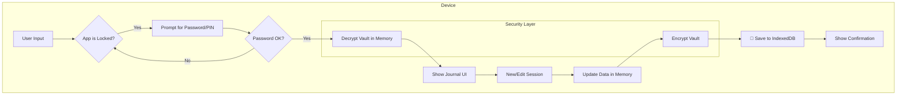

# Cognit λ — Interactive Cognitive Journal
```
   ___                  _ _     λ
  / __\___   __ _ _ __ (_) |_   
 / /  / _ \ / _` | '_ \| | __|  
/ /__| (_) | (_| | | | | | |_   
\____/\___/ \__, |_| |_|_|\__|  
            |___/                
    Cognitive Transformation Engine
```

> **Reflect. Adjust. Iterate.**


<p align="center">
  
</p>

<p align="center">
  <em>An open-source CBT (Cognitive Behavioral Therapy) and ERP (Exposure and Response Prevention) journal,<br/>
  focused on <strong>privacy</strong>, <strong>evidence-based intervention</strong>, and <strong>offline-first design</strong>.</em>
</p>

---

## ⚠️ **Aviso Importante**

**Esta aplicación NO sustituye la atención profesional de salud mental.** 

Si te encuentras en una crisis de salud mental, por favor contacta a:
- 🇺🇸 **988** — National Suicide Prevention Lifeline
- 🇪🇸 **024** — Línea de Ayuda en España
- 🇩🇴 **809-566-0100** — Servicios de Emergencia República Dominicana
- 🌍 **[findahelpline.com](https://findahelpline.com)** — Directorio Global

**O dirígete a la sala de emergencias más cercana de inmediato.**

Esta herramienta está diseñada para **complementar** la terapia, no para reemplazarla. Actúa como un "soporte para tareas" entre sesiones clínicas.

---

## 🎯 What Is Cognit λ?

**This is NOT just a mood tracker.**

Cognit λ is an **interactive cognitive coach** that teaches you to identify and restructure distorted thinking patterns using evidence-based CBT and ERP techniques. Unlike passive journaling apps, it provides:

- **Real-time feedback** on thought distortions
- **Objective metrics** (ICC, SUDS) to track cognitive change
- **Behavioral interventions** (anti-rumination pauses, breathing exercises)
- **Local-first privacy** (client-side encryption, zero cloud storage, zero analytics)
- **Offline-first after first load** (the installed PWA can keep working without internet once the shell has been cached)

---

## 📸 Quick Preview

| Feature | What It Does |
|---------|--------------|
| **Secure Vault** | **Client-side encryption (AES-GCM)** protects all your data with a password you choose. |
| **3-Level CBT Cycle** | Progress from basic logging (L1) → creative displacement (L2) → full cognitive restructuring (L3) |
| **SMART Goals** | Define and track specific, measurable, achievable, relevant, and time-bound personal goals. |
| **Behavioral Activation** | Define core values and schedule energizing activities to combat procrastination and anhedonia. |
| **ERP Protocol** | Build fear hierarchies, log exposures, and track SUDS habituation over time with automated progress charts. |
| **Sleep Diary (CBT-I)** | Log sleep patterns and automatically calculate sleep efficiency to improve sleep hygiene. |
| **Mindfulness Tools** | Includes a Gratitude Journal and a Cognitive Defusion game to practice mindfulness. |
| **Distortion Detector** | Identifies patterns like Catastrophizing, Mental Filter, Mind Reading in your automatic thoughts |
| **ICC Measurement** | Quantifies how effectively you reduce belief in distorted thoughts (0.0 - 1.0 scale) |
| **Crisis Plan** | Personal safety contacts + coping phrases, activated when high-risk language is detected |
| **Lambda λ** | Tu \"Eco Cognitivo\": un avatar que reacciona a tu estado emocional y guía las intervenciones clínicas. |
| **Auto-Lock** | Automatically locks the journal after a period of inactivity to protect from prying eyes. |
| **Offline Support** | PWA with a first-load cache strategy: once opened online, the app shell can load offline. |

---

## 🎯 Who Is This For?

### ✅ **Ideal Users:**
- Individuals in **active therapy** tracking homework between sessions
- People practicing **self-directed CBT** (with prior therapist guidance)
- Those managing **anxiety, depression, OCD** with evidence-based techniques
- Anyone wanting **objective progress metrics** instead of vague "mood tracking"
- Therapists looking for a **privacy-respecting** tool to recommend to clients

### ⚠️ **NOT Suitable For:**
- **Acute crisis situations** (use emergency services instead)
- Replacing professional diagnosis or medication management
- First-time CBT users without basic understanding (consider reading *Feeling Good* by David Burns first)
- Expecting an AI chatbot therapist (this is a structured tool, not conversational AI)

---

## 🚀 Installation

### **Option 1: Use as PWA** (Recommended)
1. Visit **[your-domain.com](https://your-domain.com)** *(replace with actual URL)*
2. Click the **"Install"** prompt in your browser
3. Launch from your home screen
4. That's it. After the first successful online load, the installed app can continue opening offline from the cached shell.

**Supported Platforms:**
- ✅ Chrome/Edge (Desktop + Android)
- ✅ Safari (iOS + macOS)
- ✅ Firefox (Desktop + Android)

---

### **Option 2: Self-Hosted** (Advanced)

```bash
# Clone the repository
git clone https://github.com/[your-username]/cognit-lambda.git
cd cognit-lambda

# Install dependencies
npm install

# Run in development mode
npm run dev
# → Open http://localhost:9002

# Build for production
npm run build
npm start
```

**System Requirements:**
- Node.js 18+
- 50MB disk space
- Modern browser with IndexedDB and Web Crypto API support

---

### **Option 3: Deploy to Vercel** (1-Click)

[](https://vercel.com/new/clone?repository-url=https://github.com/[your-username]/cognit-lambda)

**Other Hosting Options:**
- Any Node-compatible host that can run `npm run build` + `npm start`
- Self-hosted VPS (nginx reverse proxy + PM2 or another process manager)
- Static hosts only if the project is intentionally converted to `output: "export"`

---

## 📖 Quick Start Guide

### **Step 0: Create Your Secure Vault**
The first time you open the app, you will be prompted to create a password (or PIN). This password is used to encrypt all your journal entries and data directly on your device.
> **⚠️ CRITICAL WARNING:** This password is the ONLY key to your data. If you forget it, your data will be **permanently unrecoverable**. We (the developers) have zero access to it and cannot help you restore it. Write it down and store it securely.

---

### **Step 1: Your First Session (L1 - Self-Observation)**
1. Click **"New Session"**
2. Select **Level 1** (basic logging)
3. Answer the contextual prompt (e.g., *"What thought visited you most today?"*)
4. Rate your **emotion intensity** (1-10)
5. Click **Save**

**Goal:** Build awareness without judgment. Just observe.

---

### **Step 2: Progress to L3 (Full Cognitive Restructuring)**

When ready for deeper work:

1. Select **Level 3**
2. Fill out the complete CBT cycle:
   - **Situation/Trigger**: What happened?
   - **Automatic Thought**: What did you think immediately?
   - **Original Intensity**: How much did you believe it? (1-10)
   - **Evidence Against**: Challenge the thought with facts
   - **Alternative Response**: Write a balanced perspective (min. 75 characters)
   - **Final Credibility**: How much do you believe it now? (1-10)

3. The app calculates your **ICC (Cognitive Change Index)**:
   ```
   ICC = (Original Intensity - Final Credibility) / 10
   
   Example:
   Original: 8/10 ("I'm a total failure")
   Final: 3/10 (after challenging with evidence)
   ICC: (8 - 3) / 10 = 0.50 (Moderate change)
   ```

4. **Feedback Loop:**
   - ICC > 0.60: ✅ "Excellent cognitive shift!"
   - ICC < 0.35: ⚠️ "Try gathering more evidence"

---

### **Step 3: Build Your Crisis Plan**
1. Go to **⚙️ Settings → Safety/Adherence**
2. Add **emergency contacts** (name + phone)
3. Write your **personal coping phrase**  
   (e.g., *"This feeling is temporary. I will call [Contact] and use my breathing exercise."*)

**How It Activates:**
- App detects high-risk keywords (e.g., "suicide", "end it all")
- OR intensity ≥ 9/10 + negative emotion
- **Immediately shows:**
  - Your coping phrase
  - Your emergency contacts
  - Local/global crisis hotlines
  - 4-7-8 breathing guide

---

### **Step 4: Weekly Export (Data Ownership)**
1. Click **⚡ Auto-ZIP**
2. Downloads a ZIP with:
   - `Cognit-backup-cifrado-[date].json` (full **encrypted** backup for re-import)
   - Markdown/CSV/FHIR reports for portability and clinician discussion
   - `LEEME-PRIVACIDAD-[date].txt` with explicit plaintext warnings

**Important:** the encrypted JSON backup is safe to store as a backup artifact. Markdown, CSV and FHIR exports are human-readable plaintext by design; treat them like sensitive medical notes.

**Store these in:**
- Local encrypted folder (VeraCrypt, BitLocker)
- Personal cloud (Google Drive, iCloud—your choice)
- USB drive (offline backup)

---

## 🛠️ Technology Stack

| Layer | Technology | Why? |
|-------|-----------|------|
| **Framework** | Next.js 15 (App Router) | Performance, modern React patterns, great DX |
| **Language** | TypeScript | Type safety for complex therapy logic |
| **UI Components** | ShadCN UI (Radix + Tailwind) | Accessible, customizable, modern |
| **Client-Side Encryption** | Web Crypto API (AES-GCM + PBKDF2) | Strong, browser-native encryption for data at rest. |
| **Data Visualization** | Recharts | Responsive charts for ICC/SUDS tracking |
| **Local Storage** | IndexedDB (Encrypted Blob) | Handles 100s of MB, survives restarts |
| **PWA** | Native Service Worker | Offline-first shell caching, installable |
| **Icons** | Lucide React | Lightweight, consistent design |
| **Analytics** | **None** | Zero tracking = maximum privacy |
| **Backend** | **None** | No servers = no data breaches |

### **Why These Choices?**

```
Traditional Mental Health Apps:
❌ Require account creation (email, password)
❌ Store data on their servers (vulnerable to hacks)
❌ Track analytics (Google/Facebook pixels)
❌ Require internet connection
❌ Charge subscription fees

Cognit λ:
✅ No accounts (anonymous by design)
✅ Data is ENCRYPTED and stays in YOUR browser
✅ Zero external requests (no tracking)
✅ Keeps working offline after the first successful cached load (PWA)
✅ MIT licensed (free forever)
```

---

## 🧠 How It Works (Technical Overview)



### **Data Flow**
1. **Unlock**: User enters password. Data is decrypted from IndexedDB into memory.
2. **Input**: User fills CBT fields (situation, thought, evidence).
3. **In-Memory Update**: All changes are made to the data held in React's state.
4. **Validation**: Schema checks, L3 completeness.
5. **Analysis**: Distortion detection, ICC calculation, crisis scan.
6. **Save**: On saving a session, the entire data vault in memory is re-encrypted with the user's key and written back to IndexedDB as a single encrypted blob.
7. **Lock**: After inactivity or closing the tab, the in-memory data is wiped, leaving only the encrypted data on disk.

---

## 🔒 Privacy & Security

### **What We DON'T Do:**
- ❌ **No analytics** (not even privacy-friendly ones like Plausible)
- ❌ **No cloud storage** (data never leaves your device unless you manually export it)
- ❌ **No user accounts** (no email, OAuth—nothing)
- ❌ **No app cookies** (the browser may keep normal PWA/HTTP cache entries)
- ❌ **No third-party scripts** (no CDN dependencies, no external fonts)
- ❌ **No clinical journal content stored in plaintext by the app**. Non-clinical metadata such as locale and lockout timing may remain outside the encrypted vault.

### **What We DO:**
- ✅ **Client-Side Encryption (AES-GCM):** All your journal data is encrypted with a key derived from your password (using PBKDF2). The encrypted data is stored in IndexedDB.
- ✅ **Zero Knowledge:** Your password is never stored or sent anywhere. It exists only in your head and briefly in memory during use. We cannot access or recover your data.
- ✅ **Auto-Lock:** The app automatically locks after a few minutes of inactivity, requiring your password again to access the data.
- ✅ **Full Export Control:** You decide when/where to backup your **encrypted** data.
- ✅ **Open source:** Audit the code yourself.

**Plaintext export boundary:** Markdown, CSV and FHIR exports are intentionally readable so you can review or share them. They are not encrypted once downloaded.

### **HIPAA/GDPR Compliance:**

**Technically not applicable** because:
- We don't collect data (GDPR exemption: no data processor)
- We don't transmit data (HIPAA exemption: no covered entity)

**However, the architecture is privacy-by-design:**
- No PII ever leaves the device
- No server-side processing exists
- User has 100% control over data lifecycle, including its encryption key.

**⚠️ Clinical Use Warning:**  
If you self-host this for a **therapeutic practice**, consult legal counsel about:
- Informed consent requirements
- Data breach liability (if patient's device is compromised)
- Record-keeping regulations in your jurisdiction

**This app is designed for personal use, not as a clinical record system.**

### **FHIR Export Boundary**

FHIR export is provided for portability and clinician discussion. Cognit uses a local self-report code system and avoids pretending that journal summaries are diagnostic observations. High-distress interpretation flags are descriptive only and must not be treated as triage, diagnosis, or medical-device output.

---

## 🗺️ Roadmap Terapéutico: ¡Completado y Mirando al Futuro!

Hemos completado con éxito todas las fases de nuestro roadmap terapéutico, transformando Cognit λ en un verdadero copiloto cognitivo.

### ✅ **FASE 1: Análisis Proactivo e Insights (¡Completado!)**
*   **Detección de Patrones de Rumiación**: La app ahora alerta al usuario sobre patrones de pensamiento negativos y repetitivos.
*   **Análisis de Efectividad del TCC**: El dashboard muestra contra qué emociones la reestructuración es más o menos efectiva.
*   **Identificación de Triggers Clave**: El sistema detecta y presenta las situaciones que más comúnmente disparan emociones intensas.

### ✅ **FASE 2: Profundización en Ansiedad y TOC (¡Completado!)**
*   **Gráficos de Habituación Automáticos**: Los nuevos gráficos de ERP visualizan cómo la ansiedad (SUDS) disminuye con cada sesión.
*   **Registro y Desafío de Compulsiones**: Se añadió una opción en el log de exposición para registrar y desafiar las conductas de seguridad.
*   **Verificador de Predicciones Catastróficas**: El usuario ahora puede comparar el resultado temido con el real, debilitando la amenaza.

### ✅ **FASE 3: Herramientas Anti-Procrastinación y Depresión (¡Completado!)**
*   **Subtareas (Chunking) en Actividades**: Las actividades ahora se pueden descomponer en subtareas manejables, combatiendo directamente la procrastinación.
*   **Análisis del Balance Placer/Destreza**: El dashboard muestra un balance de las actividades realizadas, animando al usuario a equilibrar su semana.
*   **Planificador Proactivo**: La app ahora sugiere agendar actividades vivificantes cuando detecta baja energía.

### ✅ **FASE 4: Ecosistema y Calidad de Vida (¡Completado!)**
*   **Soporte Completo Multi-idioma (i18n)**: Se ha finalizado la traducción completa a inglés y español.
*   **Onboarding Interactivo y Recordatorios de Backup**: Se ha implementado un tour guiado para nuevos usuarios y un recordatorio inteligente para copias de seguridad.
*   **Temas Personalizables**: El usuario puede ahora elegir entre varios temas de color para personalizar su experiencia.

### ✅ **FASE FINAL: Lambda y Enfoque Clínico (¡Completado!)**
*   **Avatar \"Lambda\"**: Integración de un guía visual interactivo que adopta roles (Mentor/Ancla/Observador) según la intensidad del malestar.
*   **Onboarding con Enfoque Clínico**: El usuario ahora elige su enfoque (Ansiedad, Depresión, etc.) y recibe avisos preventivos claros.
*   **Deslindes de Responsabilidad**: Integrados en onboarding, panel de ayuda y protocolo SOS.

### 🚀 **Próximos Pasos (Visión a Futuro)**
*   **[POST-LANZAMIENTO] Sincronización Opcional Cifrada (E2E)**: Investigar un método seguro para que los usuarios puedan sincronizar sus datos cifrados entre dispositivos, manteniendo siempre el principio de "conocimiento cero".


---

## ❓ Frequently Asked Questions

### **General**

**Q: Is my data really secure?**  
A: Yes. All your data is encrypted on your device using your password. We use the standard and secure AES-GCM algorithm via the browser's native Web Crypto API. We have **zero servers** and **zero knowledge** of your password, so there's nothing for us to hack or access.

**Q: What if I forget my password?**  
A: **Your data will be permanently lost.** Because the encryption key is derived from your password and we never store it, there is absolutely no way to recover your data. This is a fundamental trade-off for true privacy. Please store your password securely.

**Q: What if I clear my browser cache/data?**  
A: You'll lose the encrypted data vault. **Prevention**: Use Auto-ZIP weekly to export backups of your encrypted data. You can re-import this file later and unlock it with your password.

**Q: Can I use this on multiple devices?**  
A: Not automatically. By design, there is no cloud sync. You can manually export your encrypted vault from Device A and import it on Device B, using the same password to unlock it.

---

### **Clinical**

**Q: Can I use this instead of therapy?**  
A: **NO.** This complements therapy, doesn't replace it. Use it for:
- Homework between sessions
- Tracking patterns to discuss with therapist
- Practicing techniques you learned in therapy

**Q: Will this cure my anxiety/depression?**  
A: No app "cures" mental health conditions. But **CBT is evidence-based** and clinically proven effective when practiced consistently with professional guidance.

**Q: Can I share my data with my therapist?**  
A: Yes! Use **Markdown Export** to generate a clean, unencrypted report. Many therapists appreciate ICC and SUDS metrics. The JSON backup, however, remains encrypted.

---

### **Technical**

**Q: Why not a native iOS/Android app?**  
A: PWAs work on all platforms without app store approval or separate codebases. You can "install" this on any device and it behaves like a native app. With client-side encryption, we can achieve a high level of security without needing a native build.

**Q: Can I self-host this for my clinic?**  
A: Yes. It's MIT licensed and can be deployed with the self-hosting steps above. Consult legal counsel for clinical compliance before using it in a therapeutic practice.

**Q. Does the auto-lock feature protect me if I leave my computer unlocked?**
A. Yes. After a few minutes of inactivity, the app will lock itself, requiring your password again. This protects your data from someone accessing your device while it's unlocked and unattended.

---

## ✅ Current Engineering Status

The remediation pass has been audited against the current codebase. The app now has an encrypted vault schema v2, encrypted form drafts, encrypted JSON backup envelopes with SHA-256 integrity checks, full-vault import replacement, a shared `JournalProvider`, guarded crisis/rumination save flows, active lint/typecheck/test/build guardrails, and defensive FHIR self-report export semantics.

Validated locally on 2026-04-22:

- `npm audit`
- `npm run lint`
- `npm run typecheck`
- `npm test -- --run`
- `npm run build`

Remaining checks are manual release checks, not code blockers: inspect browser storage with real drafts and verify PWA offline behavior after a first successful online load. See [`docs/PLAN_REMEDIACION_COGNIT.md`](./docs/PLAN_REMEDIACION_COGNIT.md) for the detailed audit table.

---

## 🙏 Acknowledgments

This project, while developed independently through lived experience and empirical iteration, aligns remarkably with established clinical research. Recognition to the pioneers:

### **Clinical Foundations:**

**Dr. Aaron T. Beck** (1921-2021)  
*Father of Cognitive Therapy*  
His work on automatic thoughts, cognitive distortions, and thought records forms the theoretical backbone of this app's L3 methodology. The ICC metric is inspired by his emphasis on measuring belief change.

**Dr. David D. Burns**  
*Author of "Feeling Good: The New Mood Therapy" (1980)*  
The app's Daily Mood Log structure mirrors his Triple Column Technique, though developed independently. His work made CBT accessible to millions.

**Dr. Edna B. Foa**  
*Pioneer of Exposure and Response Prevention (ERP)*  
The fear hierarchy and SUDS tracking features follow her clinical protocol for anxiety disorders and OCD treatment.

### **Technical Foundations:**

**shadcn/ui** — Beautiful, accessible React components  
**Vercel** — Next.js framework and deployment platform  
**Web Crypto API** — For strong, browser-native client-side encryption.

### **Community:**

The open-source mental health community, lived experience advocates, and everyone fighting the stigma around seeking help.

---

**Note:** This app was built empirically by someone who experienced CBT/ERP firsthand, not by following academic textbooks. The fact that it independently converged on clinically-validated methods is a testament to the universality of cognitive science—and the value of lived experience in tool design.

---

## 📚 Recommended Reading

If you want to deepen your understanding of the techniques used in this app:

- **"Feeling Good: The New Mood Therapy"** by David Burns  
  → The bible of self-directed CBT

- **"Mind Over Mood"** by Greenberger & Padesky  
  → Workbook format, structured exercises

- **"The Anxiety and Phobia Workbook"** by Edmund Bourne  
  → Comprehensive guide including ERP protocols

- **"Cognitive Behavior Therapy: Basics and Beyond"** by Judith Beck  
  → Clinical textbook (for therapists or advanced users)

*Disclaimer: Reading is not therapy. Consider working with a licensed professional.*

---

## 💬 Support & Community

- **🐛 Bug Reports**: [GitHub Issues](https://github.com/[your-username]/cognit-lambda/issues)
- **💡 Feature Requests**: [GitHub Discussions](https://github.com/[your-username]/cognit-lambda/discussions)
- **🔐 Security Issues**: Email `security@cognitlambda.app` *(example)*
- **🐦 Updates**: [@CognitLambda](https://twitter.com/cognitlambda) *(example)*

**Not on GitHub?** That's okay! You can still use the app—it's designed for everyone, not just developers.

---

## 📄 License

**MIT License** © 2025 [Your Name]

Permission is hereby granted, free of charge, to any person obtaining a copy of this software and associated documentation files (the "Software"), to deal in the Software without restriction, including without limitation the rights to use, copy, modify, merge, publish, distribute, sublicense, and/or sell copies of the Software...

See [LICENSE](./LICENSE) for full text.

### **What This Means:**
- ✅ Use it personally for free
- ✅ Use it in your clinic (inform patients it's not a medical device)
- ✅ Modify it for your needs
- ✅ Contribute improvements back (optional, appreciated)
- ❌ We provide no warranty (use at your own risk)

---

<p align="center">
  <strong>Made with 💙 by someone who needed this tool to exist</strong><br>
  <em>"Transform your thoughts, one function at a time."</em>
</p>

<p align="center">
  <a href="https://github.com/[your-username]/cognit-lambda">⭐ Star on GitHub</a> •
  <a href="https://your-domain.com">🌐 Try the Demo</a> •
  <a href="./CONTRIBUTING.md">🤝 Contribute</a>
</p>

---

<p align="center">
  <sub>If this tool helped you, consider sharing it with someone who might need it. ❤️</sub>
</p>
